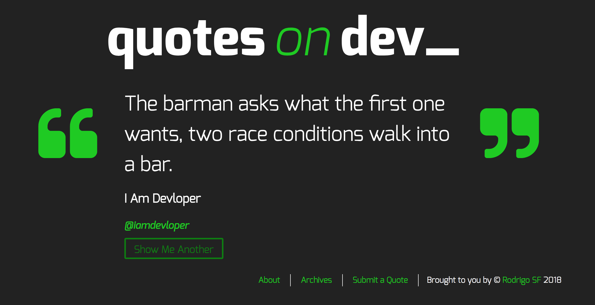

# Quotes on Dev

Quotes on Dev, my fifth project with the Red Academy, is a website inspired by Chris Coyier's [Quotes on Design](https://quotesondesign.com/) website. It uses the Wordpress rest API to fetch random quotes from the WP database and post them on the front page and submit new ones through the submit-a-quote page. 

## Installation

### 1. Download me (don't clone me!)

Then add me to your `wp-content/themes` directory.

### 2. Rename the `quotesondev-starter-master` directory

Make sure that the theme directory name is project appropriate! Do you need `starter` or `master` in the directory name?

### 3. Install the dev dependencies

Next you'll need to run `npm install` **inside your theme directory** to install the npm packages you'll need for Gulp, etc.

### 4. Update the proxy in `gulpfile.js`

Lastly, be sure to update your `gulpfile.js` with the appropriate URL for the Browsersync proxy (so change `localhost[:port-here]/[your-dir-name-here]` to the appropriate localhost URL).

And now would be a good time to `git init` :)
